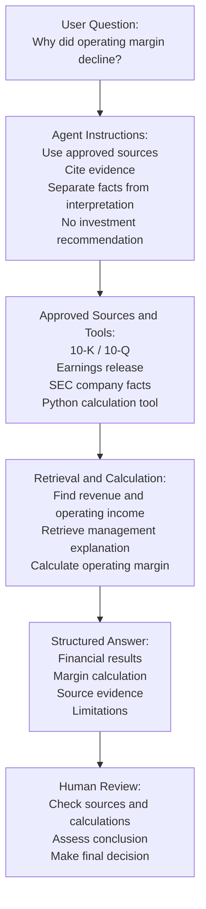

# Agentic Workflow Map

## 1. User Question 
EX: Why did operating margin decline?

## 2. Agent Instructions 
- Use approved sources
- Cite evidence
- Separate facts from interpretation
- Do not make an investment recommendation

## 3. Approved Sources / Tools
- 10-K or 10-Q
- Earnings release
- SEC company facts
- Python financial-calculation tool

## 4. Retrieval and Calculation 
- Find Revenue and operating-income data
- Retrieve management's explanation
- Calculate operating margin by period

## 5. Structured Answer 
- Financial Results
- Margin calculation
- Source evidence
- Possible explanation
- Limitations / unanswered questions

## 6. Human Review
- Check calculations and sources
- Judge whether the explanation is reasonable
- Make the final finance decision

# Completed Basic Finance-agent workflow.

